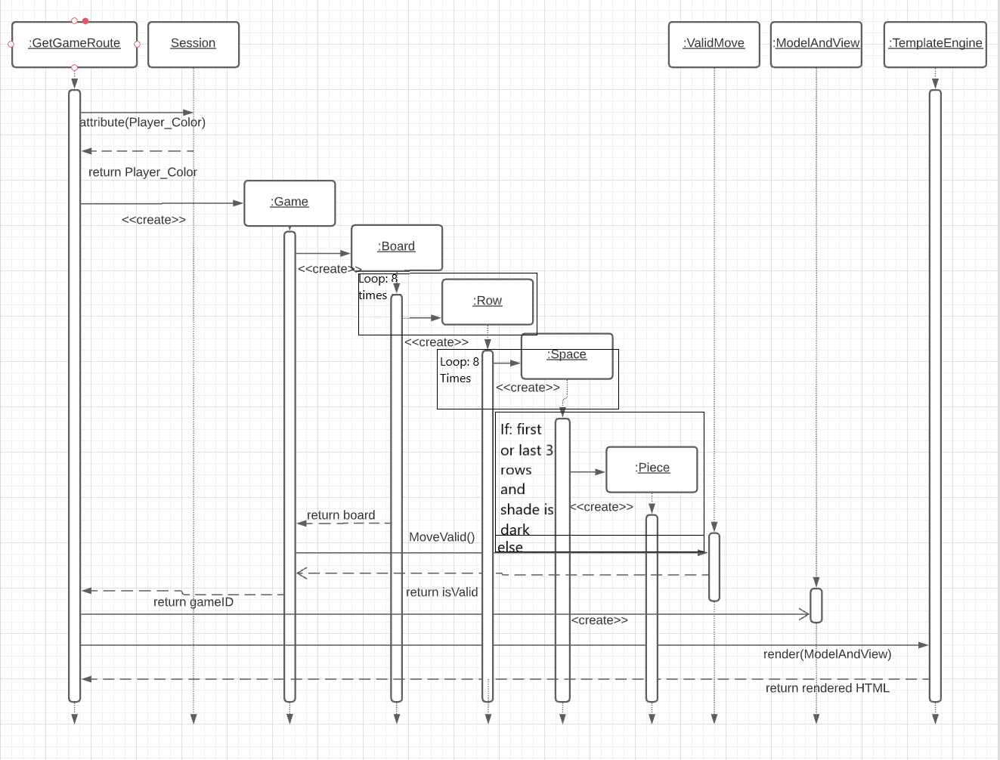
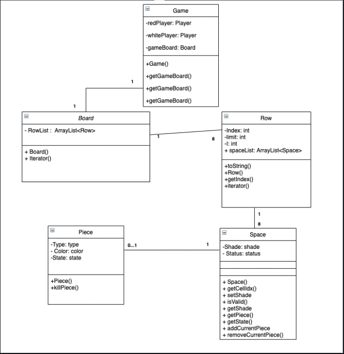
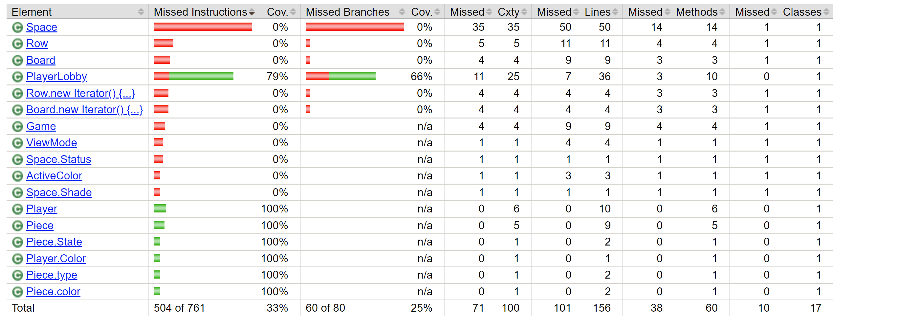
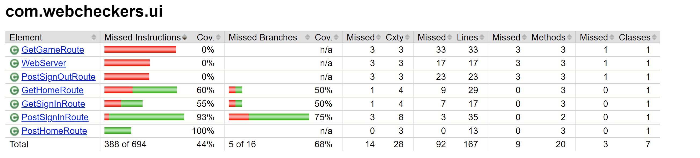
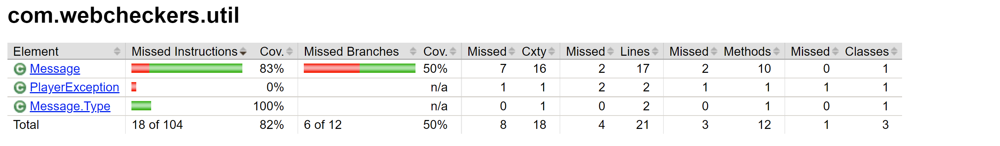

# PROJECT Design Documentation

> _The following template provides the headings for your Design
> Documentation.  As you edit each section make sure you remove these
> commentary 'blockquotes'; the lines that start with a > character
> and appear in the generated PDF in italics._ hi

## Team Information
* Team name: SWEN-261 Team 4 
* Team members
  * Ben Gurevich
  * Ryan Wolford 
  * Olaf Hichwa
  * Ardit Koti 
  * Jonah Rosenberg

## Executive Summary

This document helps convey design implementations and states that will be encapsulated in Sprint 2 
of the Webcheckers Project. 

### Purpose
Help streamline the popular board game Checkers so that it can be played with a 
simple interface with anyone you want to play with. With our spectator mode and 
replay feature, it allows for the best possible experience when playing
checkers. 

### Glossary and Acronyms
> _Provide a table of terms and acronyms._

| Term | Definition |
|------|------------|
| VO | Value Object |

## Requirements

Placeholder

> _In this section you do not need to be exhaustive and list every
> story.  Focus on top-level features from the Vision document and
> maybe Epics and critical Stories._

### Definition of MVP
In order to satisfy the Product Owner, the MVP needs to include these 3 key features:
 
 
First, every player must be able to sign-in(no invalid names allowed) before starting a game. Once done, they must be able to sign-out of the site.
 
 
Upon signing in, two players must be able to play a game of checkers with each other, if available for a game.
 
 
Finally, one of the players, may choose to resign, which will end the game instantly.

### MVP Features
In order to satisfy the Product Owner, certain Epics and top-level stories need to be integrated into the project:
 
 
<ul>
<li>Player Sign-in:</li>
<ul class="square">
  <li>The player before finding a game must be able to sign-in with a unique and valid name.</li>
</ul>
 
<li>Start a Game:</li>
<ul class="square">
  <li>The player must be able to challenge another player if they are available to play a game.</li>
</ul>
 
<li>Game Rules:</li>
<ul class="square">
  <li>The player should be able to make moves that are legal based off the <a href="http://www.se.rit.edu/~swen-261/projects/WebCheckers/American%20Rules.html">American Rules.</a></li>
</ul>
 
<li>Ending the Game:</li>
<ul class="square">
  <li>At any point in the game, one of the players should be able to resign their game, which will end the game immediately. If none choose to, then the game will end once one of the players lose all of their pieces.</li>
</ul>
 
<li>Sign-out</li>
<ul class="square">
  <li>Once the player is done playing WebCheckers, they will be able to sign-out of the game, returning to the original front page.</li>
</ul>
</ul>

### Roadmap of Enhancements
Two possible future enhancements are as follows:
 

> _Spectator Mode_
<li> Spectator mode</li>
<ul class="square">
  <li>While signed-in, players should be able to view on-going game that they are not playing.</li>
</ul>

> _Replay Mode_

<li> Replay Backlog
</li>
<ul class="square">
  <li>Every game that is played will be saved to a backlog for later viewing.
</li>
</ul>
<li> Replay Viewing
</li>
<ul class="square">
  <li>Once a player is signed-in they will be able to select a game that they played previously to step through.
</li>
</ul>
<ul class="square">
  <li>Once in a replay, the player will be able to step forward, backward, or exit the replay
</li>
</ul> 

## Application Domain

This section describes the application domain.

We start off with the Player model for the Webcheckers application. 
The Player has 4 options, regarding what they can do during their usage of the site.
The player will be able to interact with the board and that is when they will be able
to move their piece (if allowed). If the player is not playing a game, they can either spectate a match that is 
being played currently, or they can watch a game that has been previously played. 

## Architecture and Design

This section describes the application architecture.

### Summary

The following Tiers/Layers model shows a high-level view of the webapp's architecture.

As a web application, the user interacts with the system using a
browser.  The client-side of the UI is composed of HTML pages with
some minimal CSS for styling the page.  There is also some JavaScript
that has been provided to the team by the architect.

The server-side tiers include the UI Tier that is composed of UI Controllers and Views.
Controllers are built using the Spark framework and View are built using the FreeMarker framework.  The Application and Model tiers are built using plain-old Java objects (POJOs).

Details of the components within these tiers are supplied below.

### Overview of User Interface

This section describes the web interface flow; this is how the user views and interacts
with the WebCheckers application.

This Figure shows the basic state functionality of all stories that will be completed in sprint 2. Important additions
from sprint 1 include the player sign-out route from home, the game view post, and the returning to home on game end.

### UI Tier

The UI Tier of the application is responsible acting as an interface between the user,
and the back end of the application. It takes their interactions with the application
and updates their view accordingly. 
  
The core of this entire Tier is the Webserver class which is responsible for instantiation of 
all the routes that the program needs to respond to the user input. 
  
GetHomeRoute is used to transfer the view of the user to the Home page of the application. If the user
has not signed in at this point than only the amount of players currently signed in is displayed. Otherwise, 
  
GetSignIn is used to route the user to the signIn screen and prompt them for their login information.
  
PostSignIn is used to parse the login information entered. If the login is invalid an error message is displayed
to the User so that they can enter correct information. Otherwise the player is routed back toward the home page to 
engage with other users
  
PostSignOut is called when the user interacts with the sign out button. This removes them from the active
player base and makes them unable to join or watch games. It then directs them to the home page.
  
GetGame is used to start a game when one player challenges another. Both players are moved into the game view and shown
the starting position of the board.

> A Sequence Diagram from GetGameRoute

### Application Tier
The Application Tier includes the Message and PlayerException class. The Message
class is a useful and concise class that will display either an error type message or a information type message. The PlayerException class hasn't been used yet, but it still has valuable functionality that can come in handy later.

### Model Tier
The Model Tier encompasses all of the logic within the game based off the <a href="http://www.se.rit.edu/~swen-261/projects/WebCheckers/American%20Rules.html">American Checker Rules.</a>
Within the actual tier, you have the Board and Player classes. The board class creates the actual board using the Row class
to make it 2D. The player class is used for setting their name for the game. The Game class creates two Players, red and white. The PlayerLobby
class handles the name and password of the Player. Within that class, usernames and passwords are checked to see if they are valid. The Piece class has multiple states, including Color (Red or White), Variety (Regular or King), or State (Alive or Dead ).
The Space class goes through each spot on the checkerboard and whether the spot is vacant, invalid, or not, will add a piece based on the American Rules.

### Design Improvements
Overall, during Sprint 2, we made great improvements to the overall design and structure of our code. To start, we didn't exactly use the vision documents given to us for each sprint until the last week of Sprint 2. 
So, now our code is more aligned with the vision documents, so they repeat less and unnecessary code has been removed from the project.
Yet, at this point, our code is far from perfect. In order for it to meet coding standards, Law of Demeter needs to be followed. At times, our code can violate Law of Demeter. Yet, the Piece class for example helps with high cohesion, so it helps maintain the rules for checker too!

## Testing

### Acceptance Testing

Three user stories fully passed all acceptance criteria tests. One story currently has failed half its tests and five
stories did not reach the stage of testing.

### Unit Testing and Code Coverage

Our overall coverage for testing was fairly low due to a last minute rush of development with which testing was not able to 
keep pace with. This sort of rapid development can create issues later down the line when untested methods are relied upon in
futher development. In the next sprint of development the team will address these issues to give us a solid base for final development.

